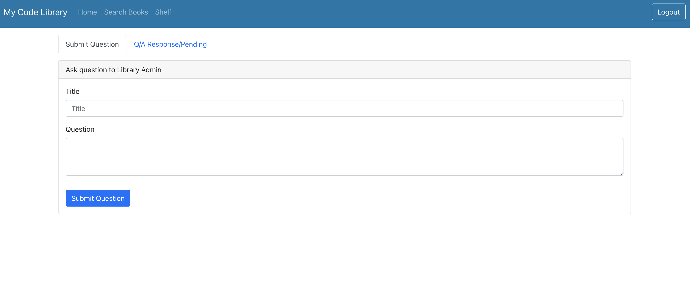

# React Springbook Library

## Description

The purpose of this application was to improve my Java/Sping boot and React skills. I was able to incorporate Typescript into the mix and get some practice with that as well. This is a library application that allows a user to check out code related books and send messages to the admin. There is also the functionality to be an admin to add, remove, or adjust book quantity as well as respond to user messages.

## Visual Exampes

  
(<a href="#top">back to top</a>)

## Tech Used

  

(<a href="#top">back to top</a>)

